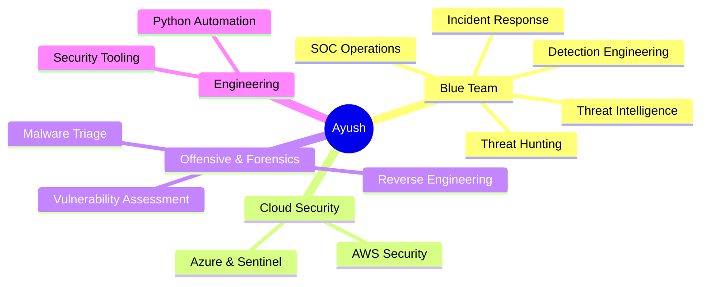

<div align="center">


<br/>

<a href="https://portfolio-nine-snowy-rn715ih1i3.vercel.app/" target="_blank">
  
</a>
<a href="https://www.linkedin.com/in/ayush55/" target="_blank">
  
</a>
<a href="https://github.com/ayushsingh-byte" target="_blank">
  
</a>
<a href="mailto:secondayush3@gmail.com">
  
</a>

<br/>


</div>


##  About Me

```yaml
name:        Ayush Kumar Singh
role:        SOC Analyst | Blue Team | Security Monitoring & Incident Response
location:    Vadodara, India
domains:     [ SOC Operations, Threat Hunting, Threat Intelligence, Detection Engineering ]
currently:   B.Tech in Cyber Security @ Parul University (2023-2027)
learning:    Azure Security, Microsoft Sentinel, Threat Hunting at scale
motto:       "Hack the problem. Secure the solution."
```

- 🛡️ SOC / Blue Team analyst triaging alerts across **Splunk** and **Microsoft Sentinel**
- 🔍 Correlate Windows, Linux, and cloud telemetry to validate threats and cut false positives
- 🎯 Skilled in threat hunting, IOC enrichment, and **MITRE ATT&CK** mapping
- 🏆 TryHackMe SAL1 certified — top 1% worldwide
- 🐝 Builder of honeypot and threat-intelligence platforms
- 💬 Ask me about SIEM rules, threat hunting, incident response, or SOC automation


## 🛠️ Tech Arsenal

<div align="center">

### 🔐 Security · SOC · Blue Team


### 🐉 Offensive & Assessment


<br/>


### 🧬 Forensics & Malware Analysis


### 🌐 Networking


### ☁️ Cloud, Infra & Automation


<br/>


### 💻 Languages & Development


<br/>


### 🧰 Tools & Workflow


<br/>


</div>


## 🚀 Featured Projects

<div align="center">

| Project | Description | Stack |
|:--|:--|:--|
| **[🛡️ Shadow Trust](https://github.com/ayushsingh-byte/ShadowTrust-Security)** | SOC & threat intelligence platform | `FastAPI` `Python` |
| **[🍯 SOC Honeynet](https://github.com/ayushsingh-byte/SOC-Honeynet)** | Attacker telemetry collection via honeypots | `Cowrie` `T-Pot` `Dionaea` |

</div>

### 🛡️ Shadow Trust — SOC & Threat Intelligence Platform

FastAPI platform in Python unifying honeypot telemetry, malware analysis, and threat intelligence into a single triage workflow. Automates IOC enrichment through VirusTotal and MalwareBazaar and maps observed activity to MITRE ATT&CK, accelerating correlation and cutting manual lookup effort during triage.

### 🍯 SOC Honeynet — Attacker Telemetry Collection

Deployed Cowrie, T-Pot, and Dionaea honeypots across multiple protocols to capture live attacker behaviour — credential attempts, probing, and exploitation patterns. Aggregated data surfaces recurring attack patterns and IOCs for detection and threat-intelligence use.


## 📊 GitHub Analytics

<div align="center">


<br/><br/>

### 📈 Contribution Graph


<br/><br/>

### 🐍 Watch the Snake Eat My Commits


<br/><br/>

### 🔎 Full Metrics


</div>

<!--
  ┌──────────────────────────────────────────────────────────────────────┐
  │  The metrics image above is generated by .github/workflows/          │
  │  metrics.yml and committed straight into this repo. It never hits    │
  │  a shared rate limit, because it runs on YOUR Actions quota.         │
  │  Setup instructions are in metrics.yml.                              │
  └──────────────────────────────────────────────────────────────────────┘
-->


## 📚 Certifications

<div align="center">


</div>

📄 Published research in **IRJMETS** (Intl. Research Journal of Modernization in Engineering, Technology & Science), 2026 — Paper ID: `IRJMETS80400235394`

## 💼 Experience

**SOC Level 1 Intern** @ Redynox (Remote) · Jan – Feb 2026
Triaged ~20 alerts/day across Splunk & Sentinel, correlated host/network logs to cut false positives, and mapped confirmed findings to MITRE ATT&CK for downstream analysts.


## 🎯 Current Focus



<div align="center">

| 🎯 Track | Progress |
|:--|:--|
| SOC & Incident Response |  |
| Detection Engineering |  |
| Cloud Security (AWS + Azure) |  |
| Threat Hunting & Intelligence |  |
| Digital Forensics |  |

</div>


## 💡 Security Thought of the Day

<div align="center">
  
</div>


## 🏅 Achievements

<div align="center">

<!-- my-badges start -->
<a href="my-badges/a-commit.md"></a>
<a href="my-badges/ab-commit.md"></a>
<a href="my-badges/epic-commit.md"></a>
<a href="my-badges/favorite-word.md"></a>
<a href="my-badges/fix-4.md"></a>
<a href="my-badges/mass-delete-commit.md"></a>
<a href="my-badges/mass-delete-commit-10k.md"></a>
<a href="my-badges/self-star.md"></a>
<a href="my-badges/sleepy-coder.md"></a>
<a href="my-badges/morning-commits.md"></a>
<a href="my-badges/abc-commit.md"></a>
<a href="my-badges/chore-commit.md"></a>
<a href="my-badges/cosmetic-commit.md"></a>
<a href="my-badges/fix-2.md"></a>
<a href="my-badges/fix-5.md"></a>
<a href="my-badges/fix-6.md"></a>
<a href="my-badges/evening-commits.md"></a>
<!-- my-badges end -->

</div>


## 📫 Connect With Me

<div align="center">

<a href="https://portfolio-nine-snowy-rn715ih1i3.vercel.app/" target="_blank">
  
</a>
<a href="https://www.linkedin.com/in/ayush55/" target="_blank">
  
</a>
<a href="https://github.com/ayushsingh-byte" target="_blank">
  
</a>

<br/><br/>


<br/>

⭐ **If my work helps you, drop a star — it genuinely helps.**


</div>
