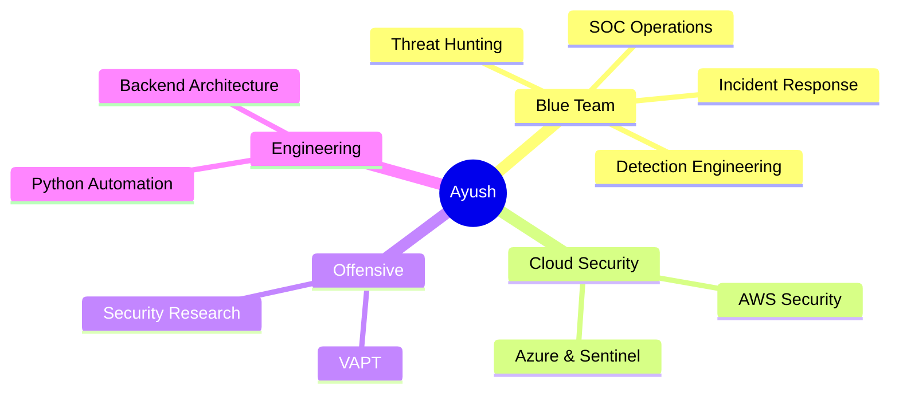

<div align="center">


<br/>

<a href="https://portfolio-nine-snowy-rn715ih1i3.vercel.app/" target="_blank">
  
</a>
<a href="https://www.linkedin.com/in/ayush55/" target="_blank">
  
</a>
<a href="https://github.com/ayushsingh-byte" target="_blank">
  
</a>
<a href="mailto:your.email@example.com">
  
</a>

<br/>


</div>


##  About Me

```yaml
name:        Ayush Kumar Singh
role:        SOC Analyst | Cybersecurity Enthusiast
location:    India
domains:     [ SOC Operations, VAPT, Cloud Security, Detection Engineering ]
currently:   Building SystemFlow - an enterprise workflow platform
learning:    Azure Security, Microsoft Sentinel, Threat Hunting at scale
motto:       "Hack the problem. Secure the solution."
```

- 🛡️ Cybersecurity student focused on **SOC**, **VAPT**, and **Cloud Security**
- 🔍 I write detections, hunt threats, and break things so they get fixed properly
- ⚙️ Backend developer with **Node.js** and automation experience
- ☁️ Deep-diving into **AWS + Azure Security**, **SIEM engineering**, and **incident response**
- 🚀 Building **SystemFlow**, an enterprise workflow automation platform
- 💬 Ask me about SIEM rules, log pipelines, recon methodology, or clean backend architecture


## 🛠️ Tech Arsenal

<div align="center">

### 🔐 Security · SOC · Blue Team


### 🐉 Offensive Security · VAPT


<br/>


### 🌐 Networking


### ☁️ Cloud


### 💻 Languages & Development


<br/>


### 🧰 Tools & Workflow


<br/>


</div>


## 🚀 Featured Projects

<div align="center">

| Project | Description | Stack |
|:--|:--|:--|
| **[🛡️ SystemFlow](https://github.com/ayushsingh-byte)** | Enterprise workflow automation platform | `Node.js` `React` `Docker` `ML` |
| **[🐍 Python Full Course](https://github.com/ayushsingh-byte)** | Beginner-friendly Python learning repo | `Python` |

</div>

### 🛡️ SystemFlow — Enterprise Workflow Automation

| Layer | What's inside |
|:--|:--|
| 🤖 **AI** | Integrated AI services + ML microservice |
| ⚡ **Performance** | Browser caching via Service Worker + IndexedDB |
| 🔐 **Security** | Hardened authentication & session handling |
| 🐳 **Deployment** | Fully Dockerized, production-grade backend |
| 🏗️ **Architecture** | Modular, scalable, API-first design |

### 🐍 Python Full Course

A complete beginner-friendly Python repository — concepts, worked examples, and hands-on exercises, from syntax basics through automation scripting.


## 📊 GitHub Analytics

<div align="center">


<br/><br/>

### 📈 Contribution Graph


<br/><br/>

### 🐍 Watch the Snake Eat My Commits


<br/><br/>

### 🔎 Full Metrics


</div>

<!--
  ┌──────────────────────────────────────────────────────────────────────┐
  │  The metrics image above is generated by .github/workflows/          │
  │  metrics.yml and committed straight into this repo. It never hits    │
  │  a shared rate limit, because it runs on YOUR Actions quota.         │
  │  Setup instructions are in metrics.yml.                              │
  └──────────────────────────────────────────────────────────────────────┘
-->


## 📚 Certifications

<div align="center">


</div>


## 🎯 Current Focus



<div align="center">

| 🎯 Track | Progress |
|:--|:--|
| SOC & Incident Response |  |
| Detection Engineering |  |
| Cloud Security (AWS + Azure) |  |
| Threat Hunting |  |
| Python Automation |  |

</div>


## 💡 Security Thought of the Day

<div align="center">
  
</div>


## 📫 Connect With Me

<div align="center">

<a href="https://portfolio-nine-snowy-rn715ih1i3.vercel.app/" target="_blank">
  
</a>
<a href="https://www.linkedin.com/in/ayush55/" target="_blank">
  
</a>
<a href="https://github.com/ayushsingh-byte" target="_blank">
  
</a>

<br/><br/>


<br/>

⭐ **If my work helps you, drop a star — it genuinely helps.**


</div>
